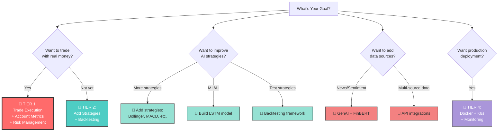

# 🎯 Quick Decision Guide: What Should I Build Next?

## Your Current Status
✅ **Working:** Real-time data → AI signals → Dashboard  
❌ **Missing:** Trade execution, account monitoring, risk controls

---

## Decision Tree

---

## The Fastest Path to Value

### Option 1: "I want a complete trading system" ⚡
**Timeline:** 1 week  
**Build:**
1. Trade execution (2-3 days)
2. Account metrics (1-2 days)
3. Basic risk management (2 days)

**Result:** Fully functional AI trading bot

---

### Option 2: "I want better strategies first" 📈
**Timeline:** 1-2 weeks  
**Build:**
1. Add 5 new strategies (5 days)
2. Backtesting framework (4 days)
3. Strategy performance comparison (2 days)

**Result:** Validated, diverse strategy portfolio

---

### Option 3: "I want AI/ML intelligence" 🤖
**Timeline:** 2 weeks  
**Build:**
1. LSTM price prediction model (5-7 days)
2. FinBERT sentiment analysis (3-4 days)
3. ML strategy integration (2 days)

**Result:** Advanced AI-powered trading

---

## My Strong Recommendation

### 🎯 Start Here: **Trade Execution**

**Why?**
- You have signals but can't act on them
- Everything else depends on this
- Highest immediate value
- Easiest to test (paper trading)

**What you'll gain:**
- ✅ Click a button, place a trade
- ✅ See your positions in real-time
- ✅ Monitor P&L live
- ✅ **Actually use your AI system!**

**After that:**
↓  
Add risk management (protect capital)  
↓  
Build backtesting (validate strategies)  
↓  
Expand with ML/GenAI

---

## The "I Have Limited Time" Plan

**Week 1:** Trade execution  
**Week 2:** Account metrics  
**Week 3:** Risk management  
**Week 4:** Backtest one strategy  

✅ After 4 weeks: **Production-ready AI trading system**

---

## The "I Love AI Research" Plan

**Week 1-2:** Build LSTM model  
**Week 3:** Add FinBERT sentiment  
**Week 4-5:** Reinforcement learning agent  
**Week 6:** Trade execution to deploy your AI

✅ After 6 weeks: **Cutting-edge AI trading research platform**

---

## Common Questions

**Q: Can I skip trade execution and just keep testing?**  
A: Yes! Focus on strategies + backtesting (Option 2). When ready, add execution later.

**Q: What if I want to add more data sources?**  
A: Start with one (like TradingView or Polygon), then expand.

**Q: Should I deploy to production now?**  
A: Only after trade execution + risk management are battle-tested.

**Q: Can I work on multiple tiers at once?**  
A: Not recommended - finish one feature completely before starting another.

---

## What Would I Do? (Personal Take)

If this were my project:

**This week:**
- Build trade execution
- Add basic stop-loss
- Test with paper trading

**Next week:**
- Add 2-3 new strategies
- Build simple backtesting
- Compare strategy performance

**Week 3-4:**
- Start LSTM model training
- Add news sentiment
- Begin live testing with small positions

**Why this order?**  
Get value early (execution), validate strategies (backtesting), then add intelligence (ML).

---

## 🚀 Ready to Start?

Pick one of these:

1. **"Let's build trade execution"** → I'll create implementation plan
2. **"Show me how to add more strategies"** → I'll write 3 new strategies  
3. **"I want to build the ML model"** → I'll set up LSTM training pipeline
4. **"Help me with backtesting first"** → I'll build backtesting framework
5. **"Something else..."** → Tell me what!

**What sounds most exciting to you?** 🎯
